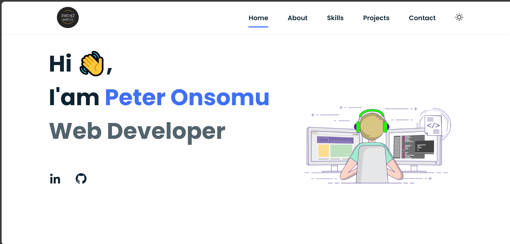

# CHANUKA LEARNING HUB

## Project Overview

This is my personal portfolio website where I showcase my works relating to web design and development and provide information about myself and work. This is where you will get more inspirational design.

## Table of Contents

- [Project Overview](#project-overview)
- [Features](#features)
- [Technologies Used](#technologies-used)
- [Usage](#usage)
- [License](#license)

## Features

- **Visual designs**: A visually appealing and creative designs for inspiration.
- **Project sections**: Sections for showcasing my projects, skills, and contact information.
- **Animations**: 3D graphics and animations for the designs.

## Technologies Used

- **Frontend**:
  - HTML5,
  - CSS3
  - JavaScript (ES6)

## Usage

- **Homepage**: Displays an overview of the platform.

## License

This project is licensed under the MIT License - see the [LICENSE](LICENSE) file for details.